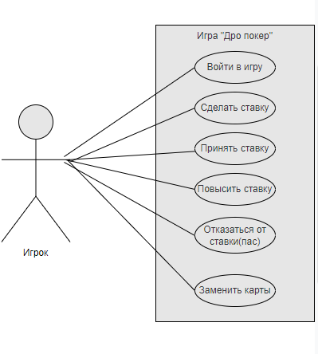

# Лабораторная работа №1

## Прецендент "Войти в игру"

| Прецедент | Войти в игру |
|---|---|
| Название | Войти в игру |
| Описание | Игрок вводит имя, и сумму взноса  |
| Основной исполнитель | Игрок |
| Предусловия | Имена игроков не введены, взносы не сделаны |
| Постусловия | Данные игроков сохранены |

**Основной сценарий:**

| Действия актора | Реакция системы |
|---|---|
|1. Запустить игру||
||2. Запросить у игрока ввод его имени, и сумму взноса|
|3. Ввести имя и сумму взноса ||
||4. Сохранить данные игрока|

**Альтернативные сценарии:**

3а Игрок не вводит данные или вводит их некорректно

> 1\.  Система сообщает об ошибке ввода данных и просит ввести их корректно

 ## Прецендент "Сделать ставку"

| Прецедент | Сделать ставку |
|---|---|
| Название | Сделать ставку |
| Описание | Игрок вводит сумму ставки|
| Основной исполнитель | Игрок |
| Предусловия | Игра не началась, игроки получили карты |
| Постусловия | Определены начальные ставки игроков. Игра началась |

**Основной сценарий:**

| Действия актора | Реакция системы |
|---|---|
|1. Игрок вводит сумму ставки||
||2. Сохранить введённые данные |
||3. Начать первый раунд |

**Альтернативные сценарии:**

1а Игрок не вводит данные или вводит их некорректно

> 1\. Система сообщает об ошибке ввода данных и просит ввести их корректно

| Прецедент | Принять ставку |
|---|---|
| Название | Принять ставку |
| Описание | Игрок принимает ставку предыдущих игроков|
| Основной исполнитель | Игрок |
| Предусловия | Наступает очередь игрока делать ставку |
| Постусловия | Данные игрока сохраняются |

**Основной сценарий:**

| Действия актора | Реакция системы |
|---|---|
|1. Согласится принять ставку||
||2. Сохранить ставку игрока|
||3. Передать ход следующему игроку|

 ## Прецендент "Повысить ставку"
 
| Прецедент | Повысить ставку |
|---|---|
| Название | Повысить ставку |
| Описание | Игрок решает не принимать ставку а повысить её
| Основной исполнитель | Игрок |
| Предусловия | Ход перешёл к игроку, предыдущие игроки уже сделали хотя бы 1 ставку |
| Постусловия | Ставка для всех игроков повышена |

**Основной сценарий:**

| Действия актора | Реакция системы |
|---|---|
|1. Повысить ставку||
||2. Повысить ставку для всех игроков|
||3. Сохранить значение ставки игрока |
||4. Передать ход следующему игроку |

**Альтернативные сценарии:**

1а Игрок не вводит данные или вводит их некорректно

> 1\.  Система сообщает об ошибке ввода данных и просит ввести их корректно

## Прецендент "Отказаться от ставки"
 
| Прецедент | Отказаться от ставки |
|---|---|
| Название | Отказаться от ставки |
| Описание | Игрок решает не принимать ставку и выйти из игры на этот раунд
| Основной исполнитель | Игрок |
| Предусловия | Ход перешёл к игроку, предыдущие игроки уже сделали хотя бы 1 ставку |
| Постусловия | Игрок теряет поставленные ранее фишки, и выходит из игры до конца раунда |

**Основной сценарий:**

| Действия актора | Реакция системы |
|---|---|
|1. Отказаться от ставки||
||2. Перенести поставленные ранее фишки игрока в банк|
||3. Вывести игрока из игры до конца раунда |
||4. Передать ход следующему игроку |

## Прецендент "Заменить карты"
 
| Прецедент | Заменить карты |
|---|---|
| Название | Заменить карты |
| Описание | Игрок решает поменять некоторые карты
| Основной исполнитель | Игрок |
| Предусловия | Ход перешёл к игроку, все игроки сделали ставки |
| Постусловия | Игрок меняет выбранные карты на новые |

**Основной сценарий:**

| Действия актора | Реакция системы |
|---|---|
|1. Выбрать карты которые нужно поменять||
||2. Выдать игроку новые карты из колоды|
||3. Сохранить данные о новых картах игрока|

**Альтернативные сценарии:**

2а Игрок не хочет менять карты

> 1\.  Игрок остается со своими картами и пропускает ход
