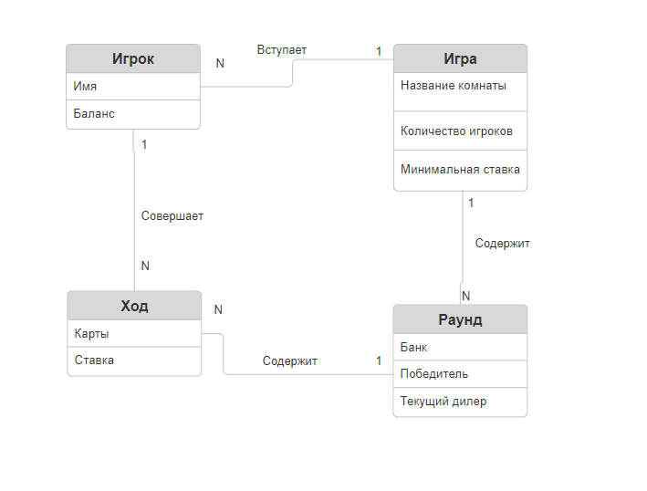

# Лабораторная работа №2
## Игра "Дро покер"

*ERD diagram*

## Игра
> Пользователь создает игру.
>
> Для создания игры пользователю нужно указать максимальное количество игроков, максимально количество раундов, минимальную ставку и название комнаты для игры.
>

## Игра - Игрок
> Игроки вступают в игру, при этом, указывая свое имя.
> 
> Так же у каждого игрока имеется определенное количество фишек, которое фиксируется у него на счету. После проигрышей или выигрышей данное число может уменьшаться или увеличиваться соответственнно.
> 
> Пользователь вступает только 1 игру в реальном времени. Игра может содержать некоторое количество игроков.

## Игрок - Ход
>  Игрок совершает ход.
> 
> В характеристиках хода указывается комбинация карт игрока и текущая ставка
>
> Игрок за игру может совершить несколько ходов. Но определенный ход совершается только одним игроком.

## Ход - Раунд
>  Раунды состоят из ходов игроков.
>
> В характеристиках раунда указывается его порядковый номер. В характеристиках раунда так же указывается победитель раунда
>
> Раунд состоит из нескольких ходов. Определенный ход принадлежит только одному раунду

## Игра - Раунд
>  Игра состоит из раундов.
>
> В характеристиках раунда указан счет общего банка, его формирование описано нижу под названием "Ставки"
> 
> Игра состоит из нескольких раундов. Определенный раунд принадлежит только одной игре

## Ставки
> Перед началом игры пользователь указывается минимальная ставка на каждый раунд. То есть это та сумма фишек, которую необходимо поставить чтобы войти в раунд игрок являющийся дилером обязательно ставит эту сумму
> После завершения раунда, выявляется победитель на счет, которого переходит общий счет банка.
> Минимальная ставка хранится именно в характеристиках игры, потому что она неизменна на протяжении всей игры.
> Общий счет банка хранится именно в характеристиках раунда, так как он может меняться от раунда к раунду. Из-за того, что игроки могут повышать ставки или отказываться от игры с плохими картами.